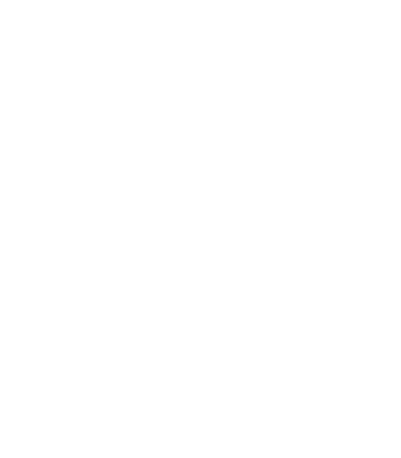

# Section 3.4 - Partie dynamique front-end (JavaScript) - VERSION DÉTAILLÉE

> Ce fichier contient le développement complet de la section 3.4 à intégrer dans `DOC_PROJET_MYCAVE.md`

---

## 3.4. Partie dynamique front-end (JavaScript)

La partie JavaScript de MyCave est intégrée directement dans les balises `<script>` des pages PHP (`dashboard.php`, `add-wine.php`), permettant une gestion dynamique des interactions utilisateur sans rechargement complet de la page. Le code utilise l'API Fetch moderne pour communiquer avec le back-end de manière asynchrone.

### 3.4.1. Fonctionnalités JS principales

#### 📍 Localisation du code JavaScript

Le code JavaScript est intégré dans **deux fichiers principaux** :

- **`dashboard.php`** : contient les fonctions de chargement, d'affichage, de suppression des vins et de mise à jour du compteur de bouteilles (lignes 58 à 230 environ).
- **`add-wine.php`** : gère la soumission du formulaire d'ajout/modification avec upload d'image (lignes 137 à 195 environ).

**Note importante** : La page **`register.php`** n'utilise **aucun JavaScript**. Elle s'appuie uniquement sur la **validation HTML5 native** via les attributs `required` et `type="email"` sur les champs de formulaire. La validation finale des mots de passe correspondants est effectuée **côté serveur en PHP** (ligne 29 du fichier).

#### 🔧 Fonctionnalités implémentées

##### 1. Gestion des formulaires avec soumission asynchrone

Le formulaire d'ajout/modification de vin utilise `FormData` pour envoyer les données, y compris les fichiers uploadés, via l'API Fetch :

```javascript
// Extrait de add-wine.php (lignes ~145-175)
document.getElementById('wineForm').addEventListener('submit', async (e) => {
  e.preventDefault(); // Empêche le rechargement de la page
  
  const formData = new FormData(e.target); // Récupère toutes les données du formulaire
  
  try {
    let response;
    
    if (isEdit) {
      // En mode édition, on simule un PUT via POST + _method
      formData.append('_method', 'PUT');
      formData.append('id', wineData.id);
      response = await fetch('api/wines.php', {
        method: 'POST',
        body: formData
      });
    } else {
      // Mode création standard
      response = await fetch('api/wines.php', {
        method: 'POST',
        body: formData
      });
    }
    
    const data = await response.json();
    
    if (data.success) {
      showMessage('🍷 Bouteille sauvegardée avec succès !', 'success');
      setTimeout(() => {
        window.location.href = 'dashboard.php'; // Redirection après succès
      }, 1500);
    } else {
      showMessage(data.error || 'Erreur lors de la sauvegarde', 'error');
    }
  } catch (error) {
    showMessage('Erreur de connexion au serveur', 'error');
  }
});
```

##### 2. Appels asynchrones à l'API

Toutes les interactions avec la base de données passent par les endpoints REST :

- **`api/wines.php`** : opérations CRUD sur les vins (GET, POST, PUT, DELETE)
- **`api/auth.php`** : authentification et gestion des sessions

Exemple de récupération des vins de l'utilisateur connecté :

```javascript
// Extrait de dashboard.php (lignes ~65-80)
async function loadWines() {
  try {
    const response = await fetch('api/wines.php'); // GET par défaut
    const data = await response.json();
    
    if (data.success) {
      displayWines(data.wines);      // Affiche les cartes
      updateBottleCount(data.count);  // Met à jour le compteur
    } else {
      showError('Erreur lors du chargement des bouteilles');
    }
  } catch (error) {
    showError('Erreur de connexion');
    console.error('Erreur:', error);
  }
}
```

##### 3. Mise à jour dynamique du DOM

###### a) Affichage dynamique des cartes de vins

La fonction `displayWines()` génère dynamiquement le HTML des cartes à partir des données JSON :

```javascript
// Extrait de dashboard.php (lignes ~95-140)
function displayWines(wines) {
  const container = document.getElementById('wines-container');
  
  // Cas où la cave est vide
  if (wines.length === 0) {
    container.innerHTML = `
      <div style="text-align: center; color: white; padding: 3rem;">
        <h3>Votre cave est vide</h3>
        <p>Commencez par ajouter votre première bouteille !</p>
        <button class="btn-primary" onclick="window.location.href='add-wine.php'">
          Ajouter une bouteille
        </button>
      </div>
    `;
    return;
  }
  
  // Génération des cartes
  container.innerHTML = wines.map(wine => createWineCard(wine)).join('');
}

function createWineCard(wine) {
  const imageUrl = wine.picture ? `uploads/${wine.picture}` : '';
  
  return `
    <div class="wine-card" data-id="${wine.id}">
      <div class="wine-image">
        
      </div>
      <div class="wine-info">
        <h3>${escapeHTML(wine.name)}</h3>
        <div class="wine-details">
          <span><strong>Année:</strong> ${wine.year}</span>
          <span><strong>Cépage:</strong> ${escapeHTML(wine.grapes)}</span>
          <span><strong>Pays:</strong> ${escapeHTML(wine.country)}</span>
          <span><strong>Région:</strong> ${escapeHTML(wine.region)}</span>
        </div>
        <div class="wine-description">${escapeHTML(wine.description)}</div>
        <div class="wine-actions">
          <button class="btn-icon" onclick="editWine(${wine.id})" title="Modifier">
            
          </button>
          <button class="btn-icon" onclick="deleteWine(${wine.id})" title="Supprimer">
            
          </button>
        </div>
      </div>
    </div>
  `;
}
```

###### b) Mise à jour du compteur de bouteilles

Le compteur en haut de page est mis à jour automatiquement après chaque opération :

```javascript
// Extrait de dashboard.php (ligne ~195)
function updateBottleCount(count) {
  document.getElementById('bottle-count').textContent = count;
}
```

###### c) Suppression sans rechargement

Lors de la suppression d'une bouteille, seule la carte concernée disparaît du DOM :

```javascript
// Extrait de dashboard.php (lignes ~165-190)
async function deleteWine(wineId) {
  // Confirmation utilisateur
  if (!confirm('Êtes-vous sûr de vouloir supprimer cette bouteille ?')) {
    return;
  }
  
  try {
    const response = await fetch(`api/wines.php?id=${wineId}`, {
      method: 'DELETE'
    });
    
    const data = await response.json();
    
    if (data.success) {
      showMessage('Bouteille supprimée avec succès', 'success', 
                  'assets/img/trash-arrow-up.svg');
      await loadWines(); // Recharge uniquement la liste des vins
    } else {
      showError(data.error || 'Erreur lors de la suppression');
    }
  } catch (error) {
    showError('Erreur de connexion');
  }
}
```

##### 4. Sécurité : échappement des données utilisateur

Pour prévenir les attaques XSS, toutes les données affichées dynamiquement sont échappées :

```javascript
// Extrait de dashboard.php (lignes ~85-90)
function escapeHTML(str) {
  const p = document.createElement('p');
  p.appendChild(document.createTextNode(str));
  return p.innerHTML;
}
```

##### 5. Affichage des messages de feedback

Une fonction centralisée gère l'affichage des messages de succès/erreur :

```javascript
// Extrait de dashboard.php (lignes ~205-230)
function showMessage(message, type, icon = null) {
  let messageDiv = document.getElementById('message');
  
  if (!messageDiv) {
    messageDiv = document.createElement('div');
    messageDiv.id = 'message';
    messageDiv.style.cssText = `
      position: fixed;
      top: 20px;
      right: 20px;
      padding: 1rem 1.5rem;
      border-radius: 8px;
      color: white;
      font-weight: bold;
      z-index: 1000;
      max-width: 300px;
      display: flex;
      align-items: center;
      gap: 0.65rem;
    `;
    document.body.appendChild(messageDiv);
  }
  
  const safeMessage = escapeHTML(message);
  const iconMarkup = icon 
    ? `` 
    : '';
  messageDiv.innerHTML = `${iconMarkup}<span>${safeMessage}</span>`;
  messageDiv.style.background = type === 'success'
    ? 'rgba(0, 255, 0, 0.8)' 
    : 'rgba(255, 0, 0, 0.8)';
  messageDiv.style.display = 'block';
  
  // Masquage automatique après 3 secondes
  setTimeout(() => {
    messageDiv.style.display = 'none';
  }, 3000);
}
```

#### 📸 Captures d'écran suggérées pour cette section

1. **Figure 3.4.1a** : Console développeur (F12) montrant l'appel `fetch('api/wines.php')` et la réponse JSON reçue avec la liste des vins.
2. **Figure 3.4.1b** : Inspecteur d'éléments montrant la structure HTML dynamique d'une carte de vin générée par JavaScript.
3. **Figure 3.4.1c** : Message de succès après ajout d'une bouteille (notification verte en haut à droite avec icône disquette).
4. **Figure 3.4.1d** : Message d'erreur en cas de problème (notification rouge).

---

### 3.4.2. Exemple d'interaction : suppression d'une bouteille

Ce scénario illustre le cycle complet d'une interaction utilisateur asynchrone sans rechargement de page.

#### 🔄 Déroulement pas à pas

##### Étape 1 : L'utilisateur clique sur l'icône "Supprimer"

```html
<!-- Bouton généré dynamiquement dans chaque carte -->
<button class="btn-icon" onclick="deleteWine(123)" title="Supprimer">
  
</button>
```

##### Étape 2 : Confirmation JavaScript

```javascript
async function deleteWine(wineId) {
  // Boîte de dialogue de confirmation native du navigateur
  if (!confirm('Êtes-vous sûr de vouloir supprimer cette bouteille ?')) {
    return; // L'utilisateur annule : on arrête ici
  }
  
  // L'utilisateur confirme : on continue avec la suppression
```

##### Étape 3 : Envoi de la requête DELETE à l'API

```javascript
  try {
    const response = await fetch(`api/wines.php?id=${wineId}`, {
      method: 'DELETE' // Méthode HTTP DELETE
    });
    
    const data = await response.json(); // Parse la réponse JSON
```

##### Étape 4 : Traitement de la réponse

```javascript
    if (data.success) {
      // ✅ Suppression réussie côté serveur
      
      // Affiche un message de succès avec l'icône de poubelle
      showMessage(
        'Bouteille supprimée avec succès', 
        'success', 
        'assets/img/trash-arrow-up.svg'
      );
      
      // Recharge la liste des vins depuis l'API
      await loadWines(); 
      // ↳ Cela va automatiquement :
      //   - Retirer la carte supprimée du DOM
      //   - Mettre à jour le compteur de bouteilles
      
    } else {
      // ❌ Erreur côté serveur
      showError(data.error || 'Erreur lors de la suppression');
    }
  } catch (error) {
    // ❌ Erreur de connexion (réseau, serveur indisponible...)
    showError('Erreur de connexion');
  }
}
```

#### 🎯 Résultat visible pour l'utilisateur

1. **Avant** : La carte de la bouteille est visible dans la grille, le compteur affiche "N bouteilles".
2. **Confirmation** : Une boîte de dialogue apparaît avec le message "Êtes-vous sûr de vouloir supprimer cette bouteille ?" et deux boutons (OK / Annuler).
3. **Pendant** : (optionnel) Un indicateur de chargement pourrait être affiché.
4. **Après (succès)** :
   - La carte disparaît instantanément de la grille.
   - Le compteur est mis à jour : "N-1 bouteilles".
   - Un message de confirmation vert s'affiche en haut à droite pendant 3 secondes avec l'icône poubelle.
5. **Après (échec)** : La carte reste visible, un message d'erreur rouge s'affiche.

#### 📸 Captures d'écran suggérées pour cette section

1. **Figure 3.4.2a** : Vue du dashboard avec curseur survolant l'icône "Supprimer" d'une carte (tooltip visible).
2. **Figure 3.4.2b** : Boîte de dialogue de confirmation native du navigateur.
3. **Figure 3.4.2c** : Console développeur montrant la requête `DELETE /api/wines.php?id=123` et sa réponse JSON `{"success": true, "message": "Vin supprimé"}`.
4. **Figure 3.4.2d** : Dashboard après suppression avec le message de succès visible et la carte disparue.
5. **Figure 3.4.2e** : Compteur de bouteilles avant/après (montage ou deux captures montrant "12 bouteilles" puis "11 bouteilles").

---

### 3.4.3. Améliorations UX et bonnes pratiques

#### ✅ Points forts actuels

- **Validation HTML5 native** : attributs `required`, types de champs (`email`, `number`), contraintes min/max sur les années.
- **Messages de feedback clairs** : distinction visuelle succès (vert) / erreur (rouge), disparition automatique après 3 secondes.
- **Gestion des erreurs réseau** : blocs `try/catch` pour capturer les problèmes de connexion.
- **Sécurité XSS** : fonction `escapeHTML()` appliquée systématiquement aux données utilisateur affichées dynamiquement.
- **Confirmation des actions destructives** : `confirm()` avant suppression pour éviter les erreurs.
- **Images de fallback** : attribut `onerror="this.style.display='none'"` si une image de bouteille est introuvable.
- **Expérience fluide** : pas de rechargement complet de page, mises à jour ciblées du DOM.

#### 🚀 Pistes d'amélioration futures

- **Validation JavaScript avancée** : vérifier le format de l'email, la longueur du mot de passe côté client avant soumission.
- **Prévisualisation d'image** : afficher un aperçu de l'image uploadée avant envoi du formulaire.
- **Indicateurs de chargement** : spinners pendant les requêtes API (notamment sur `loadWines()`).
- **Debouncing sur la recherche** : si une fonction de recherche/filtrage est ajoutée, éviter les appels API à chaque frappe.
- **Gestion d'état plus robuste** : pour une application plus complexe, envisager un state manager (Redux, Zustand) ou un framework (Vue, React).
- **Accessibilité** : améliorer la navigation au clavier, ajouter des rôles ARIA pour les messages dynamiques (`role="alert"`).
- **Mode hors ligne** : utiliser les Service Workers et le cache pour permettre la consultation même sans connexion.

#### 📸 Captures d'écran suggérées pour cette section

1. **Figure 3.4.3a** : Formulaire d'ajout avec champ vide + tentative de soumission → message de validation HTML5 natif ("Veuillez remplir ce champ").
2. **Figure 3.4.3b** : Message de succès avec icône SVG personnalisée (disquette ou poubelle).
3. **Figure 3.4.3c** : Console développeur montrant l'échappement HTML (comparaison texte brut vs. rendu final).

---

## 📝 Guide de prise de captures d'écran

Pour illustrer efficacement cette section, voici un guide des captures à réaliser :

### Pour la section 3.4.1 (Fonctionnalités JS principales)

#### Capture 3.4.1a - Appel API dans la console
1. Ouvrir le dashboard (`http://localhost/Myv12/dashboard.php`)
2. Appuyer sur F12 pour ouvrir les DevTools
3. Aller dans l'onglet "Network" (Réseau)
4. Rafraîchir la page
5. Cliquer sur la requête `wines.php`
6. Montrer :
   - La requête GET avec ses en-têtes
   - La réponse JSON avec `{"success": true, "wines": [...], "count": 12}`
7. **Annotation** : Encadrer la méthode GET et la réponse JSON

#### Capture 3.4.1b - Structure HTML dynamique
1. Toujours dans les DevTools, aller dans l'onglet "Elements" (Éléments)
2. Développer `<div id="wines-container">`
3. Montrer une carte de vin (`<div class="wine-card">`) avec sa structure complète
4. **Annotation** : Encadrer `data-id="${wine.id}"` et les boutons d'action

#### Capture 3.4.1c - Message de succès
1. Ajouter ou modifier une bouteille
2. Capturer la notification verte qui apparaît en haut à droite
3. **Annotation** : Flèche pointant vers l'icône et le texte du message

#### Capture 3.4.1d - Message d'erreur
1. Simuler une erreur (ex : déconnecter MySQL, ou modifier temporairement l'API pour retourner une erreur)
2. Tenter une action
3. Capturer la notification rouge
4. **Annotation** : Flèche pointant vers le message d'erreur

### Pour la section 3.4.2 (Exemple d'interaction : suppression)

#### Capture 3.4.2a - Survol du bouton Supprimer
1. Aller sur le dashboard
2. Survoler l'icône poubelle d'une carte
3. Capturer avec le tooltip "Supprimer" visible
4. **Annotation** : Flèche vers le bouton et le tooltip

#### Capture 3.4.2b - Boîte de confirmation
1. Cliquer sur le bouton Supprimer
2. Capturer la boîte de dialogue de confirmation
3. **Annotation** : Encadrer le message et les boutons OK/Annuler

#### Capture 3.4.2c - Console avec requête DELETE
1. DevTools ouvert, onglet Network
2. Confirmer la suppression
3. Capturer la requête DELETE avec :
   - URL : `wines.php?id=123`
   - Méthode : DELETE
   - Réponse : `{"success": true, "message": "Vin supprimé"}`
4. **Annotation** : Encadrer la méthode DELETE et la réponse JSON

#### Capture 3.4.2d - Dashboard après suppression
1. Capturer le dashboard immédiatement après suppression
2. Montrer :
   - La carte disparue
   - Le message de succès visible
   - Le compteur mis à jour
3. **Annotation** : Flèche vers le message et le compteur

#### Capture 3.4.2e - Compteur avant/après
1. **Option 1** : Deux captures séparées (avant : "12 bouteilles", après : "11 bouteilles")
2. **Option 2** : Montage côte à côte avec flèche entre les deux états
3. **Annotation** : Mettre en évidence le changement de chiffre

### Pour la section 3.4.3 (Améliorations UX)

#### Capture 3.4.3a - Validation HTML5
1. Sur le formulaire d'ajout, laisser un champ obligatoire vide
2. Tenter de soumettre
3. Capturer le message natif du navigateur ("Veuillez remplir ce champ")
4. **Annotation** : Flèche vers le message et le champ concerné

#### Capture 3.4.3b - Message avec icône personnalisée
1. Capturer un message de succès avec l'icône SVG (disquette ou poubelle)
2. Zoomer si nécessaire pour montrer l'icône clairement
3. **Annotation** : Encadrer l'icône SVG

#### Capture 3.4.3c - Échappement HTML
1. Dans la console, montrer :
   ```javascript
   escapeHTML('<script>alert("XSS")</script>')
   // Résultat : "&lt;script&gt;alert(&quot;XSS&quot;)&lt;/script&gt;"
   ```
2. **Annotation** : Montrer la transformation des caractères spéciaux

---

## 🎬 Bonus : GIF animé de suppression

Pour créer un GIF animé du processus complet de suppression :

1. **Outil recommandé** : ScreenToGif (gratuit, Windows)
2. **Étapes à enregistrer** :
   - Survol du bouton Supprimer
   - Clic sur le bouton
   - Apparition de la boîte de confirmation
   - Clic sur OK
   - Disparition de la carte
   - Apparition du message de succès
   - Mise à jour du compteur
3. **Durée recommandée** : 5-8 secondes
4. **Résolution** : 1280x720 pour une bonne lisibilité
5. **FPS** : 15 images/seconde suffisent

---

**Remarques finales :**
- Les numéros de lignes indiqués sont approximatifs et peuvent varier si le code évolue.
- Pour toutes les captures, privilégie un fond sombre (mode nuit) pour mettre en valeur le design glassmorphism de l'application.
- N'hésite pas à ajouter des annotations avec des outils comme Greenshot, ShareX ou même PowerPoint pour guider la lecture.

